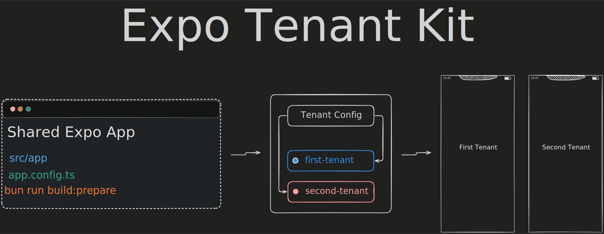

Tenkit lets you maintain one Expo codebase and ship it as separate branded mobile apps, or as one app that opens multiple runtime business contexts.

Tenkit is cloneable-starter-first: the root app has exactly one **Active Setup** at a time. The default Active Setup is **White Label Apps**, where each branded native application is an **App Variant**. **Single App Runtime Tenants** is also available as a local Scaffold, where one App Variant can open multiple **Runtime Tenants** inside the same native app. **Generic With Standalone App Variants** is available as a local Scaffold for one generic App Variant plus selected standalone App Variants.

## Why This Exists

Many mobile products start as one app, then need a second app with a different name, icon, bundle identifier, package name, theme, and EAS project. Copying the whole repository works once, but it creates drift immediately.

Tenkit keeps shared application code in one place and moves setup-specific native identity into a typed Active Setup Manifest. Build Preparation selects an App Variant, pulls the right EAS environment into `.env.local`, validates it, and runs clean Expo prebuild.

## Core Concepts

| Concept        | Meaning                                                                                                              |
| -------------- | -------------------------------------------------------------------------------------------------------------------- |
| Active Setup   | The Setup Type currently installed in the root app. The root app resolves exactly one Active Setup.                  |
| Setup Type     | The relationship model between App Variants and Runtime Tenants.                                                     |
| App Variant    | Build-time native app identity: app name, slug, scheme, bundle ID, package name, assets, and EAS project.            |
| Runtime Tenant | The business, organization, customer, or venue opened at runtime. Build Preparation does not select Runtime Tenants. |
| Example        | An opt-in verified reference. Examples are not imported by the root app.                                             |
| Scaffold       | A local setup operation that rewrites setup-owned files in the cloned starter.                                       |
| Template       | Future standalone project generation. Tenkit does not ship `tenkit init` yet.                                        |

## What You Get

- One shared Expo app using Expo Router, React Native, TypeScript, and pnpm.
- A typed Active Setup Manifest at `src/active-setup/manifest.ts`.
- Standard Expo config fields resolved from the selected App Variant.
- Public runtime bootstrap data under `extra.activeSetup`.
- Local-source Single App Runtime Tenants and Generic With Standalone App Variants shared models and Scaffolds.
- A single local CLI surface: `pnpm tenkit setup`, `pnpm tenkit build`, `pnpm tenkit reset`, and `pnpm tenkit doctor`.
- Tests around Active Setup resolution, runtime config, CLI planning/runtime behavior, setup file-plan safety, EAS JSON, and example conformance.

## What This Is Not

Tenkit is not a backend multi-tenancy system, a billing/auth framework, or a finished white-label product. Backend-source Runtime Tenant data, backend contracts, caching, auth, Runtime Tenant picker UI, and standalone Template generation are future work.

## Current Active Setup

White Label Apps is installed by default.

| App Variant ID | Slug            | App Name       | Accent    | Native IDs                         |
| -------------- | --------------- | -------------- | --------- | ---------------------------------- |
| `1`            | `first-tenant`  | `FirstTenant`  | `#208AEF` | `com.brilliantinsane.firsttenant`  |
| `2`            | `second-tenant` | `SecondTenant` | `#ef8520` | `com.brilliantinsane.secondtenant` |

If `APP_VARIANT_SLUG` is omitted, the default App Variant is used.

## Quick Start

### 1. Clone the repository

```bash
git clone <repository-url>
cd tenkit
```

### 2. Use the project Node version

Install `nvm` from the official nvm instructions, then run:

```bash
nvm install
nvm use
```

### 3. Install pnpm

Use pnpm for package scripts and dependency management in this repo. Do not use npm, Yarn, or Bun for local setup, scripts, or dependency changes.

```bash
corepack enable pnpm
pnpm --version
```

### 4. Install dependencies

```bash
pnpm install
```

### 5. Configure the local App Variant

Create `.env.local` from the example file:

```bash
cp .env.example .env.local
```

Set `APP_VARIANT_SLUG` to one of the accepted App Variant Slugs:

```bash
APP_VARIANT_SLUG=first-tenant
```

You can also use:

```bash
APP_VARIANT_SLUG=second-tenant
```

### 6. Start the app

```bash
pnpm run start
```

Expo CLI will show options for opening the app in a development build, Android emulator, iOS simulator, web browser, or Expo Go.

## Common Workflows

### Run the selected App Variant locally

```bash
pnpm run ios
pnpm run android
pnpm run web
```

These commands use the App Variant already present in `.env.local`. They do not pull EAS env vars or regenerate native projects.

### Prepare native projects

Run Build Preparation after changing App Variant, App Variant Environment, native identity, package name, scheme, icons, splash assets, or plugin config:

```bash
pnpm tenkit build
```

The command prompts for App Variant when the Active Setup has more than one App Variant, then prompts for platform and App Variant Environment. It pulls EAS env vars first, validates that `.env.local` contains the selected `APP_VARIANT_SLUG`, then runs clean Expo prebuild.

CI/non-interactive examples:

```bash
pnpm tenkit build --slug second-tenant --env development --platform ios
pnpm tenkit build --slug second-tenant --env preview --android
pnpm tenkit build --slug second-tenant --env production --both
```

### Reset native projects

```bash
pnpm tenkit reset
```

Reset uses the Active Setup default App Variant, the `development` App Variant Environment, and both platforms. It never switches Active Setup, undoes a Scaffold, or rolls back setup-owned files.

### Scaffold Single App Runtime Tenants

Inspect the file plan first:

```bash
pnpm tenkit setup --setup-type single-app-runtime-tenants --dry-run --yes
```

Apply it explicitly:

```bash
pnpm tenkit setup --setup-type single-app-runtime-tenants --yes --force
```

The Scaffold writes setup-owned Active Setup files:

- `src/active-setup/manifest.ts`
- `src/active-setup/runtime-tenants.ts`

It does not modify shared app entry points, native assets, EAS project state, local env files, or native `ios/` and `android/` directories. Starter values are intentionally generated as editable local data rather than prompted one field at a time.

### Scaffold Generic With Standalone App Variants

Inspect the file plan first:

```bash
pnpm tenkit setup --setup-type generic-with-standalone-app-variants --dry-run --yes
```

Apply it explicitly:

```bash
pnpm tenkit setup --setup-type generic-with-standalone-app-variants --yes --force
```

This Scaffold writes the same setup-owned Active Setup files:

- `src/active-setup/manifest.ts`
- `src/active-setup/runtime-tenants.ts`

The generated Starter Data includes `Atlas Network` as the Generic App Variant. Its Runtime Tenant Access allows `North Studio`, `South Studio`, and `East Studio`. `West Studio` remains a Runtime Tenant, but it is opened by its own Standalone App Variant and is excluded from the generic picker.

In this Setup Type, `runtimeTenants` means all known business contexts for the Active Setup. App Variant access decides which Runtime Tenants each installed app can open. A Generic App Variant uses selectable Runtime Tenant Access; a Standalone App Variant opens its direct Runtime Tenant.

The Scaffold does not write, copy, or generate assets. Native assets are expected under the existing Slug-based convention:

- `assets/atlas-network/...`
- `assets/west-studio/...`

### Doctor

```bash
pnpm tenkit doctor
```

## EAS Setup

Each App Variant maps to exactly one EAS Project. This open source starter intentionally keeps App Variant EAS Project IDs empty, so downstream apps must create or find their own EAS Projects first.

For each App Variant:

1. Log in with EAS CLI:

   ```bash
   eas login
   ```

2. Create or find one EAS Project in your Expo account or organization for the selected App Variant.
3. Copy that EAS Project ID.
4. Paste it into `src/active-setup/manifest.ts` at the App Variant's `eas.projectId`.
5. Repeat for every App Variant you intend to build.
6. Replace `EXPO_OWNER` in `project-config.ts` with your Expo account or organization owner.

Optional helper:

```bash
APP_VARIANT_SLUG=first-tenant eas init
```

Use `eas init` only to create or discover the App Variant's EAS Project ID. If it prints a `projectId` and then exits with an error because this app uses dynamic config, copy the printed ID and paste it into the Active Setup Manifest.

In each EAS Project, create environment variables for the EAS environments you use: `development`, `preview`, and `production`. Each environment must include `APP_VARIANT_SLUG`, and its value must match the App Variant Slug for that EAS Project.

Never put `EAS_PROJECT_ID` in EAS environment variables. EAS Project IDs live in the Active Setup Manifest; they are public identifiers, not secrets.

## Add An App Variant

For the default White Label Apps Active Setup, update:

- `src/active-setup/manifest.ts` to add the App Variant.
- `assets/<slug>/icons/` with required Android and general icon assets.
- `assets/<slug>/app.icon/` with required iOS icon asset catalog files.

Required asset paths are validated when dynamic Expo config resolves the selected App Variant.

## Project Structure

```text
.
├── app.config.ts                         # Dynamic Expo config resolved from the Active Setup
├── assets/
│   ├── first-tenant/                     # Native assets for FirstTenant
│   ├── second-tenant/                    # Native assets for SecondTenant
│   └── acme-app/                         # Native starter assets for Single App Runtime Tenants
├── examples/
│   ├── generic-with-standalone-app-variants/ # Opt-in generic plus standalone reference
│   └── single-app-runtime-tenants/       # Opt-in local-source reference example
├── scripts/
│   ├── tenkit-cli.ts                     # TypeScript CLI entrypoint
│   ├── tenkit-cli-core.ts                # Build/reset planning and validation
│   ├── tenkit-cli-runtime.ts             # EAS/env/prebuild execution
│   ├── tenkit-setup-core.ts              # Setup file-plan generation and application
│   └── tenkit-setup-runtime.ts           # Setup prompts and CLI runtime behavior
├── src/
│   ├── active-setup/                     # Installed Active Setup Manifest and runtime data
│   ├── app/                              # Expo Router screens
│   ├── hooks/                            # Runtime hooks
│   ├── providers/                        # App providers
│   ├── setup-types/                      # Shared Setup Type implementation
│   └── utils/                            # Runtime config and accent helpers
└── tests/                                # Active Setup, CLI, setup, and runtime tests
```

## Checks

Default Active Setup checks:

```bash
pnpm test
pnpm typecheck
pnpm lint
```

Opt-in Single App Runtime Tenants example check:

```bash
pnpm exec tsx --test examples/single-app-runtime-tenants/runtime-tenant-access.test.ts
```

Opt-in Generic With Standalone App Variants example check:

```bash
pnpm exec tsx --test examples/generic-with-standalone-app-variants/runtime-tenant-access.test.ts
```

## Expo Docs

This repo targets Expo SDK 56. Read the exact versioned docs before changing Expo code:

https://docs.expo.dev/versions/v56.0.0/
