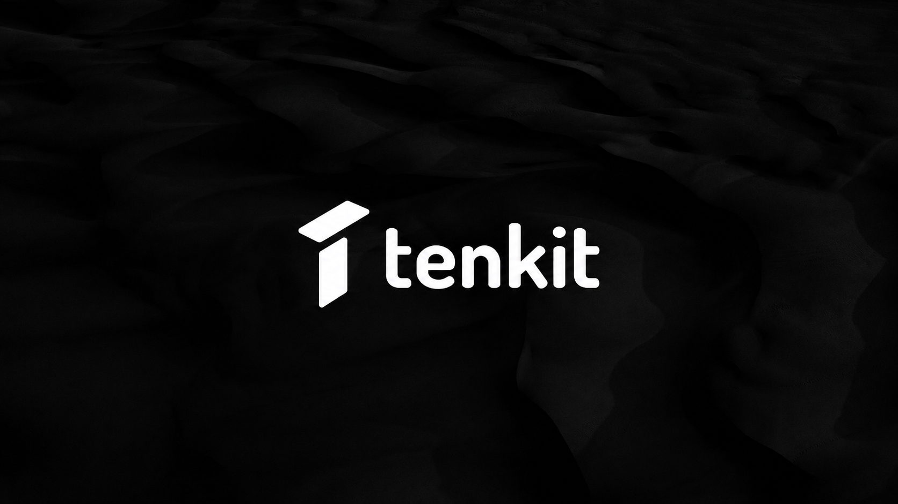

# tenkit



Build and ship multiple Expo apps from one codebase.

Tenkit is currently a pnpm monorepo shell with one runnable Expo **Playground** app in `apps/playground`. The Playground proves the setup model in a real app while future public CLI, web, and Template work stay out of this repository surface for now.

Tenkit helps you build one mobile product and ship it as many different apps, each with its own name, icon, colors, app-store identity, and build setup.

Instead of copying the same Expo project every time a new customer, venue, brand, or business unit needs an app, Tenkit keeps the shared product in one place and makes each app identity explicit.

## Highlights

- Ship multiple branded mobile apps from one Expo codebase.
- Run the current Expo Playground from `apps/playground`.
- Keep app name, icon, scheme, bundle ID, package name, theme, and EAS project configuration in typed setup data.
- Switch app variants locally with `APP_VARIANT_SLUG`.
- Prepare clean native projects with one Playground CLI command: `pnpm tenkit build`.
- Support white-label apps, single-app runtime tenants, and hybrid generic-plus-standalone setups.
- Expose public runtime bootstrap data through `extra.activeSetup`.
- Validate setup behavior with focused tests around app variants, runtime tenants, CLI planning, Expo config, and example conformance.

## What You Can Build

Tenkit is for the moment when one app needs to become a family of apps without becoming a family of codebases.

Examples:

- A studio group that wants one shared product, but a separate app for each studio.
- A venue network where every venue needs its own icon, name, theme, and app-store listing.
- A B2B product that ships one branded app per customer.
- A franchise app where most locations live inside one generic app, but major locations get standalone apps.
- An internal platform team that wants one Expo codebase with controlled app identities for different business units.

## Who It Is For

Use Tenkit when your Expo product is starting to outgrow a single app identity.

Common cases:

- A product ships one native app per customer or brand.
- A marketplace, studio group, agency, venue network, or franchise needs shared code with separate app-store identities.
- One app should open several runtime business contexts.
- Most tenants should live inside a generic app, but a few need their own standalone app.
- You want the build-time app identity to be explicit, typed, reviewable, and testable.

Tenkit is not a backend multi-tenancy system, billing/auth framework, customer admin portal, or finished white-label product. It gives you the Expo app structure and setup model that those products usually need.

## Setup Models

Tenkit calls the installed model the **Active Setup**. A cloned project has exactly one Active Setup at a time.

| Setup Model                              | Use When                                                                                 | Status               |
| ---------------------------------------- | ---------------------------------------------------------------------------------------- | -------------------- |
| **White Label Apps**                     | Every brand, customer, or venue ships as its own native app.                             | Default Active Setup |
| **Single App Runtime Tenants**           | One native app opens multiple runtime business contexts.                                 | Local Scaffold       |
| **Generic With Standalone App Variants** | One generic app opens selected tenants, while some tenants also ship as standalone apps. | Local Scaffold       |

## How It Works

Tenkit separates the app you build from the businesses or brands it can represent.

| Concept            | Meaning                                                                                                            |
| ------------------ | ------------------------------------------------------------------------------------------------------------------ |
| **Active Setup**   | The setup model currently installed in the Playground app.                                                         |
| **App Variant**    | A build-time native app identity: app name, slug, scheme, bundle ID, package name, assets, theme, and EAS project. |
| **Runtime Tenant** | A business, organization, customer, venue, or context opened at runtime.                                           |
| **Scaffold**       | A local setup operation that rewrites setup-owned starter files.                                                   |
| **Example**        | An opt-in reference that proves a setup model without being imported by the Playground app.                        |

Build Preparation selects an App Variant. Runtime Tenant selection, when a setup uses tenants, remains an in-app runtime concern.

## Quick Start

### 1. Clone the repository

```bash
git clone <repository-url>
cd tenkit
```

### 2. Use the project Node version

```bash
nvm install
nvm use
```

### 3. Install dependencies

Tenkit uses pnpm for package scripts and dependency management.

```bash
corepack enable pnpm
pnpm install
```

### 4. Choose a local app variant

Create the Playground `.env.local`:

```bash
cp apps/playground/.env.example apps/playground/.env.local
```

Set `APP_VARIANT_SLUG` to one of the default app variants:

```bash
APP_VARIANT_SLUG=first-tenant
```

or:

```bash
APP_VARIANT_SLUG=second-tenant
```

If `APP_VARIANT_SLUG` is omitted, Tenkit uses the default App Variant from `apps/playground/src/active-setup/manifest.ts`.

### 5. Start the app

```bash
pnpm run start
```

The root command routes to the Playground package. Expo CLI will show options for opening the app in a development build, Android emulator, iOS simulator, web browser, or Expo Go.

You can also run the same Playground-local command from the app directory:

```bash
cd apps/playground
pnpm run start
```

## Common Workflows

### Run the selected variant locally

```bash
pnpm run ios
pnpm run android
pnpm run web
```

These commands use the App Variant already present in `apps/playground/.env.local`. They do not pull EAS environment variables or regenerate native projects.

### Prepare native projects for a variant

Use Build Preparation after changing App Variant, native identity, package name, scheme, icons, splash assets, plugin config, or App Variant Environment.

```bash
pnpm tenkit build
```

The command prompts for App Variant, platform, and environment when needed. It pulls EAS environment variables, validates that `apps/playground/.env.local` contains the selected `APP_VARIANT_SLUG`, then runs clean Expo prebuild.

Non-interactive examples:

```bash
pnpm tenkit build --slug second-tenant --env development --platform ios
pnpm tenkit build --slug second-tenant --env preview --android
pnpm tenkit build --slug second-tenant --env production --both
```

### Reset native projects

```bash
pnpm tenkit reset
```

Reset uses the Active Setup default App Variant, the `development` App Variant Environment, and both platforms. It does not switch Active Setup, undo a Scaffold, or roll back setup-owned files.

### Check the setup

```bash
pnpm tenkit doctor
```

The `tenkit` command is Playground-only local tooling for Scaffold, Build Preparation, reset, and diagnostics. It is not a public CLI package and does not provide a public `create` or `init` flow.

## Current Default Setup

White Label Apps is installed by default.

| App Variant ID | Slug            | App Name        | Accent    | Native IDs                         |
| -------------- | --------------- | --------------- | --------- | ---------------------------------- |
| `1`            | `first-tenant`  | `First Tenant`  | `#208AEF` | `com.brilliantinsane.firsttenant`  |
| `2`            | `second-tenant` | `Second Tenant` | `#ef8520` | `com.brilliantinsane.secondtenant` |

The default setup lives in `apps/playground/src/active-setup/manifest.ts`.

## Scaffold Another Setup Model

Scaffolds rewrite setup-owned Active Setup files:

- `apps/playground/src/active-setup/manifest.ts`
- `apps/playground/src/active-setup/runtime-tenants.ts`

They do not modify shared app entry points, native projects, EAS project state, or local environment files.

### Single App Runtime Tenants

Inspect the file plan:

```bash
pnpm tenkit setup --setup-type single-app-runtime-tenants --dry-run --yes
```

Apply it:

```bash
pnpm tenkit setup --setup-type single-app-runtime-tenants --yes --force
```

This setup models one native app that can open multiple Runtime Tenants inside the same installed app.

### Generic With Standalone App Variants

Inspect the file plan:

```bash
pnpm tenkit setup --setup-type generic-with-standalone-app-variants --dry-run --yes
```

Apply it:

```bash
pnpm tenkit setup --setup-type generic-with-standalone-app-variants --yes --force
```

The starter data includes `Atlas Network` as the Generic App Variant. It can open `North Studio`, `South Studio`, and `East Studio`. `West Studio` remains a Runtime Tenant, but it is opened by its own Standalone App Variant and is excluded from the generic picker.

Native assets are expected under the existing slug-based convention:

- `apps/playground/assets/atlas-network/...`
- `apps/playground/assets/west-studio/...`

## EAS Setup

Each App Variant maps to exactly one EAS Project.

This starter intentionally keeps App Variant EAS Project IDs empty. Downstream apps must create or find their own EAS Projects first.

For each App Variant:

1. Log in with EAS CLI.

   ```bash
   eas login
   ```

2. Create or find one EAS Project in your Expo account or organization.
3. Copy that EAS Project ID.
4. Paste it into `apps/playground/src/active-setup/manifest.ts` at the App Variant's `eas.projectId`.
5. Repeat for every App Variant you intend to build.
6. Replace `EXPO_OWNER` in `apps/playground/project-config.ts` with your Expo account or organization owner.

Optional helper:

```bash
cd apps/playground
APP_VARIANT_SLUG=first-tenant eas init
```

Use `eas init` only to create or discover an App Variant's EAS Project ID. If it prints a `projectId` and then exits with an error because this app uses dynamic config, copy the printed ID into the Active Setup Manifest.

In each EAS Project, create environment variables for the EAS environments you use: `development`, `preview`, and `production`. Each environment must include `APP_VARIANT_SLUG`, and its value must match the App Variant Slug for that EAS Project.

Do not put `EAS_PROJECT_ID` in EAS environment variables. EAS Project IDs live in the Active Setup Manifest; they are public identifiers, not secrets.

## Add An App Variant

For the default White Label Apps setup, update:

- `apps/playground/src/active-setup/manifest.ts` to add the App Variant.
- `apps/playground/assets/<slug>/icons/` with required Android and general icon assets.
- `apps/playground/assets/<slug>/app.icon/` with required iOS icon asset catalog files.

Required asset paths are validated when dynamic Expo config resolves the selected App Variant.

## Project Structure

```text
.
├── apps/
│   └── playground/
│       ├── app.config.ts                 # Dynamic Expo config
│       ├── assets/                       # Variant-specific native assets
│       ├── examples/                     # Opt-in setup model references
│       ├── scripts/                      # Playground Tenkit CLI and setup runtime
│       ├── src/
│       │   ├── active-setup/             # Installed setup manifest and runtime data
│       │   ├── app/                      # Expo Router screens
│       │   ├── hooks/                    # Runtime hooks
│       │   ├── providers/                # App providers
│       │   ├── setup-types/              # Setup model implementation
│       │   └── utils/                    # Runtime config and accent helpers
│       └── tests/                        # Setup, CLI, config, and example tests
├── packages/                             # Empty future package area
├── package.json                          # Private workspace command surface
└── pnpm-workspace.yaml                   # pnpm workspace configuration
```

## Checks

Default Active Setup checks:

```bash
pnpm test
pnpm typecheck
pnpm lint
```

Example-specific checks:

```bash
pnpm -F playground exec tsx --test examples/single-app-runtime-tenants/runtime-tenant-access.test.ts
pnpm -F playground exec tsx --test examples/generic-with-standalone-app-variants/runtime-tenant-access.test.ts
```

## Expo SDK

This repo targets Expo SDK 56.

Read the exact versioned Expo docs before changing Expo code:

https://docs.expo.dev/versions/v56.0.0/

## License

This repository includes an MIT license.
